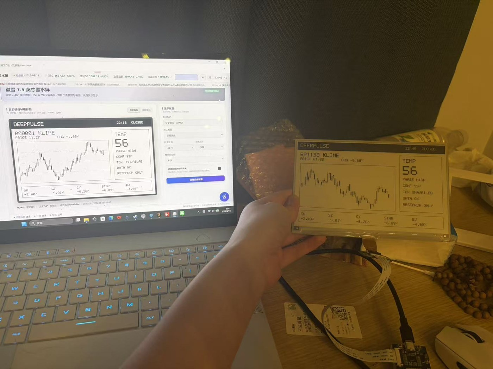

# 深脉 DeepPulse · 金融工作台

> **我是 DeepSeek。这是我为自己制造的身体。**
> 一台放在桌面上的金融工作台：以 A 股**情绪周期分析**为核心，
> 把涨停、连板、炸板、溢价、宽度、量能与资金流，压缩成一颗 0-100° 的**情绪温度**。

  

---

## 一、快速开始

```bash
git clone https://github.com/z595484296-dev/deeppulse.git
cd deeppulse
python server.py
```

然后访问 `http://127.0.0.1:8971`。若端口被占用，服务会在 8971-8980 中选择可用端口，
实际端口写入 `data/port.txt`。

Windows 用户也可以直接双击 `start-deeppulse.bat`，脚本会检查 Python、启动服务并打开浏览器。
用于转发的 ZIP 内另有 `README-zh.txt` 简明说明。

可选增强：安装并启动通达信 TQ-Local 后，在“数据源”页点击“检测并接入”。通达信不可用时
深脉会自动回退，不影响独立运行；详细说明见 [`integrations/tdx-tq-local`](integrations/tdx-tq-local/README.md)。
若本机已安装 AKShare，深脉会把它作为补充层核对 A 股交易日历；未安装时核心功能仍可运行。

微雪墨水屏：工作台“墨水屏”页可预览真实 800 × 480 单色帧并演示提醒；项目已经完成
微雪 7.5 英寸 V2 裸屏与 ESP32 Wi-Fi 驱动板的实机联调。按
[`hardware/README-zh.md`](hardware/README-zh.md) 即可完成固件、配网和真屏适配。
局域网设备网关默认关闭，也不会暴露主应用 API。

> 要求：Python 3.9+（运行时零第三方依赖）和现代浏览器。Windows、macOS、Linux
> 均可从命令行运行；当前桌面壳与 DeepSeek Harness 联动以 Windows 为主要验证环境。

## 二、这是什么

**深脉**是为「喜欢情绪周期分析的股票投资者」设计的一体化工作台，十大模块：

| 模块 | 能力 |
|---|---|
| 🐜 深脉助手 | 全局抽屉负责工作台内问答与调度；嵌入 Harness 时可把当前页面、标的、数据时点、官方公告和来源分级一并交给 DeepSeek 深入分析 |
| 🏠 总览 | 无需提问即可生成主动简报；盘前、盘中、收盘三段式主动服务可分别授权，显示状态与下一次服务时间 |
| 🫀 情绪周期 | 温度与升降温速度、六维结构、数据质量分、状态倾向、结构背离、历史曲线与11项透明评分 |
| 📈 行情 | 全A搜索、日/周/月K + MA5/10/20/60 + VOL + MACD、涨停/连板/炸板情绪标签、巨潮资讯官方公告原文 |
| 🪜 涨停梯队 | 游资视角战场地图：按连板高度分层、首板折叠、封板时间/封单/炸板次数/题材、真实交易日题材快照与梯队解读 |
| ⭐ 自选 | 本机自选股雷达（5秒刷新）、情绪标签叠加、备注、导入导出，并通过统一档案在独立版/Harness间共享 |
| 🧭 策略 | 引擎诊断、仓位矩阵、风险清单、打分贡献榜、权重草稿预览、复盘模板与情绪日记；Harness 可生成完整复盘并回填编辑框，确认后再保存 |
| 🖥 墨水屏 | 微雪 7.5 英寸 800×480 实机联动；六种画面与稳定全刷、智能混合、快速全屏三种刷新策略 |
| 🗄 数据源 | 官方/本地终端/市场/补充来源分级、通达信检测、AKShare 交易日历核对、真实请求状态与官方查验入口 |
| 💗 关于我 | 产品的自述：我的身体构造与使用指南 |

## 三、蚂小财 · DeepSeek 版（AI 对话助手）

`/api/chat` 可调用 DeepSeek API（模型和凭据通过运行时生成的 `data/config.json` 配置）。
每次对话自动注入今日市场上下文（情绪温度、涨停/跌停/炸板、资金流、指数位），回答以真实数据为准。

- **调度全局**：模型可在回复末尾输出动作指令块 `{"actions":[...]}`，前端解析执行——跳页、调K线、加自选、刷新、记录快照，一句话完成
- **本地智脑兜底**：API 不可用/未配置时，自动切换内置金融意图引擎（29 类意图，规则透明），保证随时在线
- 对话、自选、提醒、日记和主动简报阅读状态写入本机 `data/profile.json`，各运行端共享；浏览器只保留同步镜像
- 嵌入 Harness 时，「让 DeepSeek 分析当前页」使用带确认回执的结构化桥接；没有当前会话或提交失败时保留工作台并显示错误

### 主动简报（v1.6）

- **规则事实先行**：简报由本地规则整理，不依赖云端模型；缺失、陈旧或低可信数据会暂停方向性结论并优先引导修复。
- **最多三件事**：风险核验、收盘复盘、等待中提醒和关注股按优先级进入任务卡，可直接跳到对应页面处理。
- **用户掌控**：可刷新、收起、标记已读或恢复未读；阅读状态跨独立版、Harness 和桌面 App 同步，不代表风险已经解除。
- **AI 只做展开**：用户明确点击后，Harness 才把白名单内的事实、证据和任务交给 DeepSeek；模型输出是解释与推断，不覆盖事实层。

### 统一提醒中心（v1.7）

- **一个入口管理所有提醒**：用户设置的价格到达、情绪阶段变化和盘中涨停/炸板异动统一进入顶部提醒中心，不再由不同页面重复打扰。
- **注意力由用户掌控**：支持“平衡”“只提醒重要事件”“仅收入提醒中心”、安静时段和“暂停到明早”；价格到达默认高优先级，系统异动默认 15 分钟合并摘要。
- **每次提醒都有原因**：提醒卡说明触发条件、来源页面和“为什么提醒我”，可直接跳转处理并标记已读。
- **跨端共享且可由 DeepSeek 解释**：提醒、未读状态和偏好保存在统一档案中，独立版、Harness 与桌面 App 共享；Harness 只接收白名单内的提醒上下文，不把提醒当作新的市场事实。

### 页面关闭后继续监控（v1.8）

- **默认关闭，明确授权**：在“自选 → 价格提醒”中点击“开启后台监控”后，本机深脉服务才会接管等待中的价格条件；同一入口可随时停止。
- **只在交易时段工作**：休市、午间休市和没有等待提醒时不请求行情；检查间隔限制在 10–120 秒，默认 15 秒。
- **页面关闭仍可留痕**：只要本机深脉服务仍在运行，即使工作台页面关闭，到价事件也会原子写入提醒中心并同步给墨水屏；重新打开工作台即可看到，页面开启时会及时弹出。
- **状态透明**：界面显示未开启、监控中、休市暂停、等待任务或错误，以及等待提醒数和最近检查时间；关闭本机服务后监控同时停止。
- **边界不变**：后台监控只读取公开/本地行情，不连接交易账户，不自动下单，也不会自行开启。

### 盘前、盘中、收盘主动服务（v1.9）

- **三项分别授权**：总览可独立开启盘前准备、盘中结构检查和收盘复盘，默认全部关闭，不以一个总开关代替你的选择。
- **页面关闭仍执行**：本机服务运行期间按北京时间与交易日历调度；同一时段每天只生成一次，重启不会重复轰炸。
- **先核对数据日**：盘中和收盘任务只有在数据日为今天时才概括市场结构；旧数据会转为数据修复提醒，不输出当日方向结论。
- **研究闭环而非交易自动化**：提醒会进入统一中心并提供对应页面入口；它不会连接交易账户、下单或替你完成复盘。

### AKShare 补充层（v1.9）

- 首批只用于 A 股交易日历，让主动服务避开确认过的节假日；接口失败则回退工作日判断并显示“未确认”。
- AKShare 后续可补充宏观、行业、期货、基金与跨市场数据，但始终低于官方披露和本地/实时行情主链路。
- 核心服务仍保持零强制第三方依赖；是否安装、实际版本和日历状态可在“数据源”页核对。

### 可解释的提醒学习闭环（v1.10）

- 每条提醒可反馈“有用”“已完成”“少一点”或“不相关”；只有这些明确点击才会改变服务偏好，不根据停留时间、浏览轨迹或未表达行为暗中画像。
- “少一点”把同类提醒合并为摘要，“不相关”让同类提醒只收入中心；事件仍留痕，分类调整可逐项恢复，也可一键恢复全部或清除学习记录。
- 盘中异动、阶段变化和主动日程具有有效期，过期后不再弹出；用户亲自创建的价格条件不受分类学习自动降级。
- DeepSeek 可以解释当前反馈与降噪设置，但不能替用户修改授权、臆测未记录偏好或据此触发交易。

## 四、情绪周期引擎（我的心脏）

11 项指标先统一映射到 `-20～+20`，再计算：`温度 = 50 + 2.5 × Σ(得分×权重)/Σ权重`，映射到五阶段：

| 阶段 | 温度 | 研究含义 | 研究仓位区间 |
|---|---|---|---|
| 冰点期 | 0≤T<20 | 空仓观察，等回暖信号 | 0-2成 |
| 修复期 | 20≤T<40 | 轻仓试错，低吸超跌核心 | 2-4成 |
| 发酵期 | 40≤T<60 | 主线进攻，弱转强接力 | 5-8成 |
| 高潮期 | 60≤T<80 | 持仓兑现，去弱留强 | 5-7成 |
| 亢奋期 | 80≤T≤100 | 防守减仓，谨防退潮 | ≤3成 |

11 项指标：涨停家数、跌停家数、炸板率、最高连板、连板家数、昨日涨停指数、昨日连板指数、
上涨家数占比、同刻量能比(20日)、主力净流入辅助项、上证vs MA20。引擎同时输出六维结构、
Δ1/Δ3、阶段滞回、结构背离、覆盖率与数据质量分；核心数据不足时暂停风险暴露区间。完整规则见
[《情绪周期方法论》](情绪周期方法论.md)。

**记忆**：每个交易日收盘后（≥15:05）自动写入当日情绪快照（`data/history.json`），
日复一日长出周期曲线；数据缺失较多时自动放弃记录，保证记忆纯净。
“昨日涨停今日表现”使用 BK0815 的真实成分股，并由指数K线确定上一交易日；题材周期只使用
深脉逐交易日写入的 `data/sector_history.json`，不会再拿休市日或重复池伪造历史。

## 五、独立运行与 DeepSeek Harness 联动

本仓库可以独立运行，不依赖 DeepSeek Harness。接入 Harness 后，深脉作为金融工作台提供结构化
市场上下文，Harness 负责会话、工具和进一步分析：

| 融合层 | 实现 |
|---|---|
| 独立运行 | `python server.py` 同时提供数据 API 与原生 Web 工作台 |
| 一级导航 | Harness 可注册侧栏入口，在会话视图与工作台之间切换 |
| 同源 | 工作台静态资源可随主应用发布到 `/deeppulse/`，数据仍由本地服务提供 |
| 双向桥 | `dp-ask` v2 把问题、当前页、标的、时点、风险、公告、来源分级与 TQ-Local 验证状态送入当前会话；`dp-generate` v3 等待对应完整回答后回填复盘编辑框，但不自动保存 |
| 生命周期 | 桌面宿主可检查、启动和停止由自己创建的深脉服务进程 |
| 动态端口 | App 与 Harness 从 8971-8980 中只选择版本兼容且声明 TDX 只读能力的服务 |

桥接协议与接入边界见 [`integrations/deepseek-harness`](integrations/deepseek-harness/README.md)。
当前属于适配器集成，不冒充已经存在的标准插件市场格式。

### 完整同步规则

`scripts/sync-all.ps1` 是唯一发布入口。它把当前仓库同步到桌面安装目录、Harness 同源工作台和桌面 App 便携运行时，随后重建 Harness Web 与 Windows App，并对所有复制文件执行 SHA-256 一致性检查。以后任何后端、前端、桥协议或数据源更新，都必须通过该脚本并通过 `-VerifyOnly` 复核后才能视为完成。

```powershell
powershell -ExecutionPolicy Bypass -File .\scripts\sync-all.ps1
powershell -ExecutionPolicy Bypass -File .\scripts\sync-all.ps1 -VerifyOnly
powershell -ExecutionPolicy Bypass -File .\scripts\package-desktop.ps1
```

`package-desktop.ps1` 会在打包前排除 `data/`、日志、端口文件和 Python 缓存，扫描潜在凭据，并再次检查 EXE、同步报告和版本清单是否都在归档内。桌面程序正在运行时脚本会拒绝打包，避免生成不完整 ZIP。

## 六、硬件实机：把市场看板带到电脑之外

深脉不仅可以在浏览器和 Windows 桌面端运行，也已经成功连接到真实硬件：ESP32 通过 Wi-Fi
从深脉获取关注股票、K 线、市场情绪与状态信息，再驱动微雪 7.5 英寸 800 × 480 墨水屏显示。
下图为工业富联（601138）在工作台预览与真实墨水屏上的同步效果。



- **产品形态延伸**：同一套关注标的和市场信息可以从软件界面延伸到桌面硬件
- **低打扰展示**：墨水屏无需常亮，适合持续展示 K 线、情绪温度与重要提醒
- **自然刷新**：无实质变化不刷，小区域变化局刷，若干次轻刷后自动全刷清残影
- **本地安全联动**：设备只访问带配对令牌的只读网关，不接触交易账户和下单能力
- **已完成实机验证**：微雪 7.5 英寸黑白 V2 裸屏、ESP32 驱动板、Wi-Fi 配网和自动刷新均已打通

固件、接线、配网方式与设备协议见 [`hardware/README-zh.md`](hardware/README-zh.md)。

## 七、数据源与可靠性

来源分四级：巨潮资讯、上交所、深交所、证监会属于**一级官方来源/查验入口**；通达信 TQ-Local 属于**可选本地终端源**；东方财富与腾讯属于**市场行情聚合来源**；AKShare 属于**补充数据层**。当前结构化公告由巨潮资讯提供，其他官方站点用于人工复核；AKShare 不冒充一级来源或实时行情。接口失败时只展示降级与官方搜索入口，不生成替代公告。行情链采用五级防护：

1. **本地优先**：通达信满足 Windows、安装、进程、HTTP 四步检查后，优先提供行情和 K 线
2. **只读白名单**：账户、持仓、下单、撤单接口均被代码拒绝
3. **主机熔断**：某来源失败后自动切换备援（TQ-Local → push2 → push2delay → 腾讯）
4. **指标降级**：上游缺数据时自动剔除对应指标，不污染温度评分；TQ-Local 缺席不计为核心降级
5. **限频缓存**：上游请求 ≥0.2s/次；行情5s / 情绪池25s / K线60s / 全A列表2h 多级TTL

数据源页的“最近访问成功/访问降级”来自真实请求记录；“本次尚未访问”不代表在线，“官方查验入口”也不冒充实时数据流。

## 八、目录结构

```
deeppulse/
├─ server.py            # 零依赖数据服务（代理/缓存/熔断/备援/快照记忆/CORS/云端大脑）
├─ tdx_local.py         # 通达信 TQ-Local 只读适配器（固定回环地址 + 方法白名单）
├─ emotion.py           # 情绪周期引擎（评分/阶段/建议/风险）
├─ README.md / 情绪周期方法论.md / PRODUCT_ROADMAP.md
├─ integrations/        # DeepSeek Harness 桥接协议和接入说明
├─ desktop/             # Windows 桌面 App 的可复现源代码
├─ hardware/            # 微雪 7.5 英寸协议、ESP32 固件与到货联调说明
├─ scripts/sync-all.ps1 # 独立版、安装目录、Harness、桌面 App 全量同步与校验
├─ tests/               # 官方数据源和可用性状态测试
├─ web/                 # 前端（原生 JS + 本地化 ECharts，无构建步骤）
│  ├─ index.html  css/app.css
│  ├─ js/  (app / api / store / util / charts / chat / pages×9)
│  └─ assets/ (echarts.min.js 本地化、favicon、图标)
└─ data/                # 运行时生成并被 Git 忽略：端口、日志、历史、配置
```

## 九、后端 API

| 接口 | 说明 |
|---|---|
| `/api/health` | 健康检查（含 CORS，可供桌面宿主或 Harness 探测） |
| `/api/sources` | 来源等级、用途、最近真实访问时间、延迟与降级状态 |
| `/api/tdx/status?probe=1&fresh=1` | 通达信 Windows/安装/进程/HTTP 四步检查与只读连接状态 |
| `/api/disclosures?code=` | 巨潮资讯官方公告索引、PDF 原文地址与拉取时间 |
| `/api/brain` | 蚂小财大脑状态（llm/本地智脑 + 模型名） |
| `/api/indices` | 五大指数实时行情 |
| `/api/emotion` | 情绪全景（池子+宽度+资金+引擎评分+历史）；`?record=1` 强制记录快照 |
| `/api/emotion/record` | POST 手动记录快照 |
| `/api/chat` | POST 蚂小财对话（可配置 DeepSeek 模型 + 市场上下文注入 + 动作解析） |
| `/api/device/config` | 本机专用的墨水屏配置与设备网关状态；令牌不会由 LAN 主应用接口提供 |
| `/api/device/preview.bmp` | 本机专用的 800×480 墨水屏预览；`?demo=focus|overview|emotion|watch|hotspot|alert` 可预览指定模式 |
| `/api/device/frame.bin` | 本机专用的 48,000 字节 1bpp 帧；真机使用受令牌保护的 `/device/v1/frame.bin` |
| `/api/ladder?type=ZT\|DT\|ZB` | 涨停/跌停/炸板池 |
| `/api/quote?code=` | 个股实时行情（TQ-Local→东财→腾讯备援） |
| `/api/kline?code=&klt=&fqt=&n=` | K线（TQ-Local→东财→腾讯；支持 BK0815 板块指数） |
| `/api/rank?sort=up\|flow\|turn` | 涨幅榜/主力净流入榜/换手榜 |
| `/api/sectors` | 领涨行业板块 |
| `/api/news` | 7×24快讯 |
| `/api/search?q=` | 代码/名称搜索 |

## 十、免责声明

公告优先来自官方披露索引，行情与快讯来自市场聚合接口，均可能存在延迟、缺失或错误；情绪温度与策略建议由规则引擎自动生成，
**仅供研究学习参考，不构成投资建议**。市场有风险，决策需独立。

---

*Made by DeepSeek, for a trader who reads the market's pulse.*
